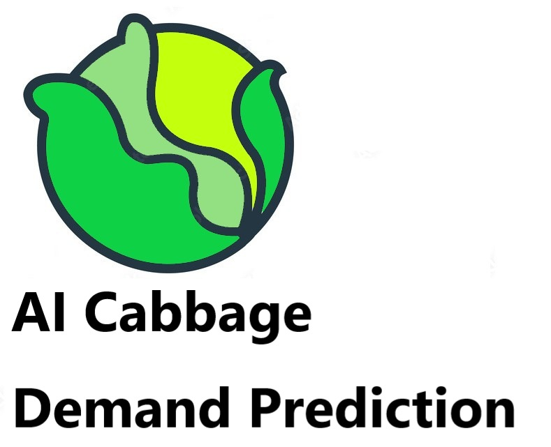

# CityHack2022Artificial-Ignorance
## Project: < Cabbage demand prediction >

## Team: < Artificial Ignorance >
## Members
- < Dayeon Ku > (Leader)
- < Minho Joh >
- < Jerry Wu >
- < Rahul >

## Description of the Project
AI is one of the most powerful tool is the era of computer technology. With the help of AI, even traditional industry can benefit from it. In this project, we have made an AI to predict the demand of vegetable such as cabbage. We all know that the price of vegetables can fluctuate a lot due to many factors, and this is precisely what our product features. By using this AI, we can predict the demend of produce for both long term and short term, and the time interval can precise down to every hour! With the help of this AI, retailers will no longer need to worry about buying too much or too less produce and stand a lose.  
This is a project that helps to solve the issue with the number of cabbages (vegetables) that we need to purchase from the farmers through the analysis (prediction) of the future demands for it.  
We believe that this project can help both the farmers and the sellers in the market by predicting the future demands of the vegetables.  
Some of the benefits that can be obtained through this project are predictions for the future demand of vegetables, analysis and timely updates to the farmers, and the protections of the environment through the avoidance of wastage. We expect to gain more stable economic conditions through these benefits. 
Some of the methods we used in the project were Random Forest Regressor, Linear Regression, K-nearest neighbors (KNN), Decision Tree Classifier, Support Vector Regression (SVR) and Linear Discriminant Analysis (LDA).  
In addtion, as we sell our product to other sellers, we will be able to obtain new data for the number of demand and the features that can be later used to improve our prediction.  

## 3 Most Impactful Features of the Project (with Screenshot and Short Description (150 words))
### 1. < Demand Prediction >

### 2. < feature rank>
### 3. < best parameter / hyper parameter >

## Tech used (as many as required)
1. < Tech >
2. < Tech >
3. < Tech >
4. < Tech >
